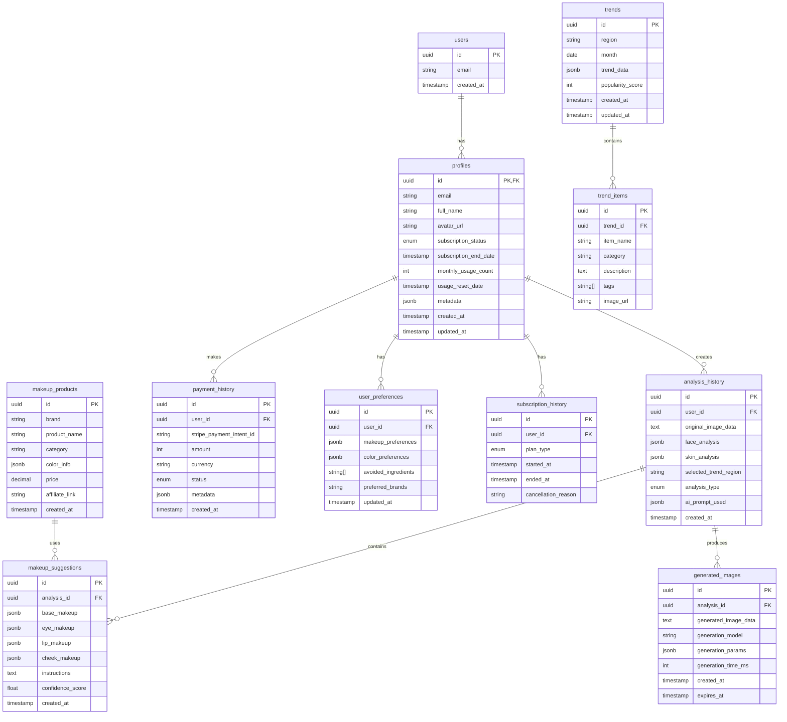

# メイク指導アプリ データベーススキーマ設計書

## 1. データベース全体構成

### 1.1 ERD（Entity Relationship Diagram）



## 2. テーブル定義詳細

### 2.1 基本テーブル

```sql
-- ==========================================
-- 1. profiles テーブル（ユーザープロファイル）
-- ==========================================
CREATE TABLE profiles (
    id UUID PRIMARY KEY REFERENCES auth.users(id) ON DELETE CASCADE,
    email TEXT UNIQUE NOT NULL,
    full_name TEXT,
    avatar_url TEXT,
    subscription_status TEXT NOT NULL DEFAULT 'free' 
        CHECK (subscription_status IN ('free', 'premium', 'cancelled')),
    subscription_end_date TIMESTAMP WITH TIME ZONE,
    monthly_usage_count INTEGER NOT NULL DEFAULT 0,
    usage_reset_date TIMESTAMP WITH TIME ZONE DEFAULT NOW(),
    
    -- メタデータ（拡張用）
    metadata JSONB DEFAULT '{}'::jsonb,
    
    -- パーソナルカラー診断結果
    personal_color_type TEXT CHECK (personal_color_type IN 
        ('spring', 'summer', 'autumn', 'winter', NULL)),
    face_shape TEXT CHECK (face_shape IN 
        ('oval', 'round', 'square', 'heart', 'oblong', NULL)),
    skin_type TEXT CHECK (skin_type IN 
        ('dry', 'oily', 'combination', 'normal', 'sensitive', NULL)),
    
    -- タイムスタンプ
    created_at TIMESTAMP WITH TIME ZONE DEFAULT NOW(),
    updated_at TIMESTAMP WITH TIME ZONE DEFAULT NOW(),
    last_login_at TIMESTAMP WITH TIME ZONE,
    
    -- インデックス用
    CONSTRAINT valid_email CHECK (email ~* '^[A-Za-z0-9._%+-]+@[A-Za-z0-9.-]+\.[A-Za-z]{2,}$')
);

-- インデックス
CREATE INDEX idx_profiles_subscription_status ON profiles(subscription_status);
CREATE INDEX idx_profiles_usage_reset_date ON profiles(usage_reset_date);
CREATE INDEX idx_profiles_email ON profiles(email);

-- ==========================================
-- 2. analysis_history テーブル（分析履歴）
-- ==========================================
CREATE TABLE analysis_history (
    id UUID PRIMARY KEY DEFAULT gen_random_uuid(),
    user_id UUID NOT NULL REFERENCES profiles(id) ON DELETE CASCADE,
    
    -- 画像データ（Base64またはURL）
    original_image_data TEXT,
    image_storage_url TEXT, -- 将来的な外部ストレージ用
    
    -- 分析データ
    face_analysis JSONB NOT NULL DEFAULT '{}'::jsonb,
    skin_analysis JSONB DEFAULT '{}'::jsonb,
    current_makeup_analysis JSONB DEFAULT '{}'::jsonb, -- 既存メイクの分析
    
    -- 分析設定
    selected_trend_region TEXT DEFAULT 'japan',
    analysis_type TEXT NOT NULL DEFAULT 'standard' 
        CHECK (analysis_type IN ('standard', 'quick', 'detailed', 'professional')),
    occasion TEXT CHECK (occasion IN 
        ('daily', 'business', 'party', 'date', 'wedding', 'photo_shoot', NULL)),
    
    -- AI処理情報
    ai_model_version TEXT,
    ai_prompt_used JSONB,
    processing_time_ms INTEGER,
    
    -- ステータス
    status TEXT NOT NULL DEFAULT 'pending' 
        CHECK (status IN ('pending', 'processing', 'completed', 'failed')),
    error_message TEXT,
    
    -- タイムスタンプ
    created_at TIMESTAMP WITH TIME ZONE DEFAULT NOW(),
    completed_at TIMESTAMP WITH TIME ZONE,
    
    -- ソフトデリート
    deleted_at TIMESTAMP WITH TIME ZONE
);

-- インデックス
CREATE INDEX idx_analysis_history_user_created ON analysis_history(user_id, created_at DESC);
CREATE INDEX idx_analysis_history_status ON analysis_history(status);
CREATE INDEX idx_analysis_history_deleted_at ON analysis_history(deleted_at);

-- ==========================================
-- 3. makeup_suggestions テーブル（メイク提案）
-- ==========================================
CREATE TABLE makeup_suggestions (
    id UUID PRIMARY KEY DEFAULT gen_random_uuid(),
    analysis_id UUID NOT NULL REFERENCES analysis_history(id) ON DELETE CASCADE,
    
    -- メイク提案詳細
    base_makeup JSONB NOT NULL DEFAULT '{}'::jsonb,
    /* 例: {
        "foundation": {"type": "liquid", "shade": "natural beige", "finish": "dewy"},
        "concealer": {"areas": ["under_eye", "blemishes"], "shade": "light"},
        "powder": {"type": "translucent", "application": "t-zone"}
    } */
    
    eye_makeup JSONB NOT NULL DEFAULT '{}'::jsonb,
    /* 例: {
        "eyeshadow": {"colors": ["brown", "beige", "gold"], "technique": "gradient"},
        "eyeliner": {"type": "pencil", "color": "dark_brown", "style": "natural"},
        "mascara": {"type": "volume", "color": "black"}
    } */
    
    lip_makeup JSONB NOT NULL DEFAULT '{}'::jsonb,
    /* 例: {
        "color": "coral_pink",
        "finish": "glossy",
        "liner": false,
        "technique": "gradient"
    } */
    
    cheek_makeup JSONB NOT NULL DEFAULT '{}'::jsonb,
    /* 例: {
        "blush": {"color": "peach", "placement": "apple_of_cheeks"},
        "highlighter": {"areas": ["cheekbones", "nose_bridge"], "intensity": "subtle"},
        "contour": {"areas": ["jawline", "nose_sides"], "shade": "light_brown"}
    } */
    
    -- 手順とアドバイス
    instructions TEXT[],
    tips TEXT[],
    warnings TEXT[], -- 注意点（敏感肌向けなど）
    
    -- 推奨製品（将来実装用）
    recommended_products UUID[],
    
    -- スコアと評価
    confidence_score FLOAT CHECK (confidence_score >= 0 AND confidence_score <= 1),
    suitability_score FLOAT CHECK (suitability_score >= 0 AND suitability_score <= 1),
    
    -- ユーザーフィードバック
    user_rating INTEGER CHECK (user_rating >= 1 AND user_rating <= 5),
    user_feedback TEXT,
    
    created_at TIMESTAMP WITH TIME ZONE DEFAULT NOW()
);

-- インデックス
CREATE INDEX idx_makeup_suggestions_analysis ON makeup_suggestions(analysis_id);
CREATE INDEX idx_makeup_suggestions_rating ON makeup_suggestions(user_rating);

-- ==========================================
-- 4. generated_images テーブル（生成画像）
-- ==========================================
CREATE TABLE generated_images (
    id UUID PRIMARY KEY DEFAULT gen_random_uuid(),
    analysis_id UUID NOT NULL REFERENCES analysis_history(id) ON DELETE CASCADE,
    
    -- 画像データ
    generated_image_data TEXT, -- Base64エンコード
    thumbnail_data TEXT, -- サムネイル用
    storage_url TEXT, -- 外部ストレージURL
    
    -- 生成情報
    generation_model TEXT NOT NULL, -- 'imagen', 'dall-e', etc.
    generation_params JSONB DEFAULT '{}'::jsonb,
    prompt_template TEXT,
    seed_value INTEGER,
    
    -- パフォーマンス
    generation_time_ms INTEGER,
    model_version TEXT,
    
    -- 管理
    view_count INTEGER DEFAULT 0,
    is_favorite BOOLEAN DEFAULT FALSE,
    
    -- 有効期限（ストレージ管理用）
    created_at TIMESTAMP WITH TIME ZONE DEFAULT NOW(),
    expires_at TIMESTAMP WITH TIME ZONE DEFAULT (NOW() + INTERVAL '30 days'),
    deleted_at TIMESTAMP WITH TIME ZONE
);

-- インデックス
CREATE INDEX idx_generated_images_analysis ON generated_images(analysis_id);
CREATE INDEX idx_generated_images_expires ON generated_images(expires_at);
CREATE INDEX idx_generated_images_favorite ON generated_images(is_favorite) WHERE is_favorite = true;

-- ==========================================
-- 5. user_preferences テーブル（ユーザー設定）
-- ==========================================
CREATE TABLE user_preferences (
    id UUID PRIMARY KEY DEFAULT gen_random_uuid(),
    user_id UUID UNIQUE NOT NULL REFERENCES profiles(id) ON DELETE CASCADE,
    
    -- メイク好み
    makeup_preferences JSONB DEFAULT '{}'::jsonb,
    /* 例: {
        "style": ["natural", "korean", "western"],
        "intensity": "medium",
        "finish": "dewy"
    } */
    
    -- カラー好み
    color_preferences JSONB DEFAULT '{}'::jsonb,
    /* 例: {
        "favorite_colors": ["pink", "coral", "brown"],
        "avoided_colors": ["purple", "blue"]
    } */
    
    -- アレルギー・成分
    avoided_ingredients TEXT[],
    skin_concerns TEXT[], -- 'acne', 'dryness', 'sensitivity', etc.
    
    -- ブランド好み
    preferred_brands TEXT[],
    budget_range JSONB, -- {"min": 1000, "max": 5000, "currency": "JPY"}
    
    -- 通知設定
    notification_settings JSONB DEFAULT '{
        "email": true,
        "push": true,
        "trends": true,
        "promotions": false
    }'::jsonb,
    
    -- 言語・地域
    language TEXT DEFAULT 'ja',
    timezone TEXT DEFAULT 'Asia/Tokyo',
    
    created_at TIMESTAMP WITH TIME ZONE DEFAULT NOW(),
    updated_at TIMESTAMP WITH TIME ZONE DEFAULT NOW()
);

-- インデックス
CREATE UNIQUE INDEX idx_user_preferences_user ON user_preferences(user_id);

-- ==========================================
-- 6. payment_history テーブル（支払い履歴）
-- ==========================================
CREATE TABLE payment_history (
    id UUID PRIMARY KEY DEFAULT gen_random_uuid(),
    user_id UUID NOT NULL REFERENCES profiles(id) ON DELETE CASCADE,
    
    -- Stripe情報
    stripe_payment_intent_id TEXT UNIQUE,
    stripe_customer_id TEXT,
    stripe_subscription_id TEXT,
    
    -- 支払い詳細
    amount INTEGER NOT NULL, -- 単位：円
    currency TEXT NOT NULL DEFAULT 'jpy',
    payment_method TEXT, -- 'card', 'bank_transfer', etc.
    
    -- ステータス
    status TEXT NOT NULL CHECK (status IN 
        ('pending', 'processing', 'succeeded', 'failed', 'cancelled', 'refunded')),
    
    -- プラン情報
    plan_type TEXT CHECK (plan_type IN ('premium_monthly', 'premium_yearly', 'one_time')),
    billing_period_start TIMESTAMP WITH TIME ZONE,
    billing_period_end TIMESTAMP WITH TIME ZONE,
    
    -- メタデータ
    metadata JSONB DEFAULT '{}'::jsonb,
    failure_reason TEXT,
    refund_amount INTEGER,
    refunded_at TIMESTAMP WITH TIME ZONE,
    
    created_at TIMESTAMP WITH TIME ZONE DEFAULT NOW(),
    updated_at TIMESTAMP WITH TIME ZONE DEFAULT NOW()
);

-- インデックス
CREATE INDEX idx_payment_history_user ON payment_history(user_id);
CREATE INDEX idx_payment_history_status ON payment_history(status);
CREATE INDEX idx_payment_history_stripe_ids ON payment_history(stripe_payment_intent_id, stripe_subscription_id);

-- ==========================================
-- 7. subscription_history テーブル（サブスク履歴）
-- ==========================================
CREATE TABLE subscription_history (
    id UUID PRIMARY KEY DEFAULT gen_random_uuid(),
    user_id UUID NOT NULL REFERENCES profiles(id) ON DELETE CASCADE,
    
    -- プラン情報
    plan_type TEXT NOT NULL CHECK (plan_type IN ('free', 'premium_monthly', 'premium_yearly')),
    previous_plan_type TEXT,
    
    -- 期間
    started_at TIMESTAMP WITH TIME ZONE NOT NULL DEFAULT NOW(),
    ended_at TIMESTAMP WITH TIME ZONE,
    is_active BOOLEAN DEFAULT TRUE,
    
    -- キャンセル情報
    cancelled_at TIMESTAMP WITH TIME ZONE,
    cancellation_reason TEXT,
    cancellation_feedback TEXT,
    
    -- プロモーション
    promotion_code TEXT,
    discount_percentage INTEGER CHECK (discount_percentage >= 0 AND discount_percentage <= 100),
    
    created_at TIMESTAMP WITH TIME ZONE DEFAULT NOW()
);

-- インデックス
CREATE INDEX idx_subscription_history_user ON subscription_history(user_id);
CREATE INDEX idx_subscription_history_active ON subscription_history(is_active) WHERE is_active = true;
CREATE INDEX idx_subscription_history_dates ON subscription_history(started_at, ended_at);

-- ==========================================
-- 8. trends テーブル（トレンド情報）
-- ==========================================
CREATE TABLE trends (
    id UUID PRIMARY KEY DEFAULT gen_random_uuid(),
    
    -- 地域と期間
    region TEXT NOT NULL CHECK (region IN 
        ('global', 'japan', 'korea', 'china', 'usa', 'europe')),
    month DATE NOT NULL,
    season TEXT CHECK (season IN ('spring', 'summer', 'autumn', 'winter')),
    
    -- トレンドデータ
    trend_data JSONB NOT NULL DEFAULT '{}'::jsonb,
    /* 例: {
        "themes": ["natural", "glossy", "bold_lip"],
        "colors": {"lip": ["red", "pink"], "eye": ["brown", "orange"]},
        "techniques": ["gradient_lip", "puppy_eye"],
        "influences": ["k-pop", "sustainability"]
    } */
    
    -- 人気度とソース
    popularity_score INTEGER CHECK (popularity_score >= 0 AND popularity_score <= 100),
    data_sources TEXT[], -- 'instagram', 'tiktok', 'magazines', etc.
    
    -- 関連情報
    featured_looks JSONB DEFAULT '[]'::jsonb,
    celebrity_references TEXT[],
    
    -- 管理
    is_published BOOLEAN DEFAULT FALSE,
    published_at TIMESTAMP WITH TIME ZONE,
    
    created_at TIMESTAMP WITH TIME ZONE DEFAULT NOW(),
    updated_at TIMESTAMP WITH TIME ZONE DEFAULT NOW(),
    
    -- ユニーク制約
    UNIQUE(region, month)
);

-- インデックス
CREATE INDEX idx_trends_region_month ON trends(region, month DESC);
CREATE INDEX idx_trends_published ON trends(is_published, published_at DESC);
CREATE INDEX idx_trends_popularity ON trends(popularity_score DESC);

-- ==========================================
-- 9. trend_items テーブル（トレンドアイテム）
-- ==========================================
CREATE TABLE trend_items (
    id UUID PRIMARY KEY DEFAULT gen_random_uuid(),
    trend_id UUID NOT NULL REFERENCES trends(id) ON DELETE CASCADE,
    
    -- アイテム情報
    item_name TEXT NOT NULL,
    category TEXT NOT NULL CHECK (category IN 
        ('technique', 'color', 'product', 'style', 'tool')),
    
    -- 詳細
    description TEXT,
    instructions TEXT,
    difficulty_level TEXT CHECK (difficulty_level IN ('easy', 'medium', 'hard')),
    
    -- メディア
    image_urls TEXT[],
    video_url TEXT,
    tutorial_url TEXT,
    
    -- タグと検索
    tags TEXT[],
    keywords TEXT[],
    
    -- 人気度
    popularity_score INTEGER DEFAULT 0,
    engagement_count INTEGER DEFAULT 0,
    
    created_at TIMESTAMP WITH TIME ZONE DEFAULT NOW()
);

-- インデックス
CREATE INDEX idx_trend_items_trend ON trend_items(trend_id);
CREATE INDEX idx_trend_items_category ON trend_items(category);
CREATE INDEX idx_trend_items_tags ON trend_items USING GIN(tags);

-- ==========================================
-- 10. makeup_products テーブル（化粧品マスタ）
-- ==========================================
CREATE TABLE makeup_products (
    id UUID PRIMARY KEY DEFAULT gen_random_uuid(),
    
    -- 製品基本情報
    brand TEXT NOT NULL,
    product_name TEXT NOT NULL,
    product_line TEXT, -- シリーズ名
    sku TEXT UNIQUE,
    
    -- カテゴリ
    category TEXT NOT NULL CHECK (category IN 
        ('foundation', 'concealer', 'powder', 'blush', 'highlighter', 
         'eyeshadow', 'eyeliner', 'mascara', 'eyebrow', 
         'lipstick', 'lip_gloss', 'lip_liner', 'primer', 'setting_spray')),
    sub_category TEXT,
    
    -- 色情報
    color_name TEXT,
    color_info JSONB, -- {"hex": "#FF5733", "rgb": [255, 87, 51], "undertone": "warm"}
    
    -- 価格情報
    price DECIMAL(10, 2),
    currency TEXT DEFAULT 'JPY',
    
    -- リンク
    official_url TEXT,
    affiliate_link TEXT,
    
    -- 評価
    average_rating FLOAT,
    review_count INTEGER DEFAULT 0,
    
    -- 在庫・販売状況
    is_available BOOLEAN DEFAULT TRUE,
    discontinued BOOLEAN DEFAULT FALSE,
    
    -- メタデータ
    ingredients TEXT[],
    tags TEXT[],
    
    created_at TIMESTAMP WITH TIME ZONE DEFAULT NOW(),
    updated_at TIMESTAMP WITH TIME ZONE DEFAULT NOW(),
    
    -- ユニーク制約
    UNIQUE(brand, product_name, color_name)
);

-- インデックス
CREATE INDEX idx_makeup_products_brand ON makeup_products(brand);
CREATE INDEX idx_makeup_products_category ON makeup_products(category);
CREATE INDEX idx_makeup_products_available ON makeup_products(is_available) WHERE is_available = true;
CREATE INDEX idx_makeup_products_tags ON makeup_products USING GIN(tags);
```

## 3. Row Level Security (RLS) ポリシー

```sql
-- RLSを有効化
ALTER TABLE profiles ENABLE ROW LEVEL SECURITY;
ALTER TABLE analysis_history ENABLE ROW LEVEL SECURITY;
ALTER TABLE makeup_suggestions ENABLE ROW LEVEL SECURITY;
ALTER TABLE generated_images ENABLE ROW LEVEL SECURITY;
ALTER TABLE user_preferences ENABLE ROW LEVEL SECURITY;
ALTER TABLE payment_history ENABLE ROW LEVEL SECURITY;
ALTER TABLE subscription_history ENABLE ROW LEVEL SECURITY;

-- ==========================================
-- profiles テーブルのポリシー
-- ==========================================
-- ユーザーは自分のプロフィールのみ参照可能
CREATE POLICY "Users can view own profile" 
    ON profiles FOR SELECT 
    USING (auth.uid() = id);

-- ユーザーは自分のプロフィールのみ更新可能
CREATE POLICY "Users can update own profile" 
    ON profiles FOR UPDATE 
    USING (auth.uid() = id);

-- 新規ユーザー作成時のプロフィール作成
CREATE POLICY "Users can insert own profile" 
    ON profiles FOR INSERT 
    WITH CHECK (auth.uid() = id);

-- ==========================================
-- analysis_history テーブルのポリシー
-- ==========================================
-- ユーザーは自分の分析履歴のみ参照可能
CREATE POLICY "Users can view own analysis" 
    ON analysis_history FOR SELECT 
    USING (auth.uid() = user_id AND deleted_at IS NULL);

-- ユーザーは自分の分析履歴のみ作成可能
CREATE POLICY "Users can create own analysis" 
    ON analysis_history FOR INSERT 
    WITH CHECK (auth.uid() = user_id);

-- ユーザーは自分の分析履歴のみ更新可能（ソフトデリート含む）
CREATE POLICY "Users can update own analysis" 
    ON analysis_history FOR UPDATE 
    USING (auth.uid() = user_id);

-- ==========================================
-- makeup_suggestions テーブルのポリシー
-- ==========================================
-- ユーザーは自分の分析に紐づく提案のみ参照可能
CREATE POLICY "Users can view own suggestions" 
    ON makeup_suggestions FOR SELECT 
    USING (
        EXISTS (
            SELECT 1 FROM analysis_history 
            WHERE analysis_history.id = makeup_suggestions.analysis_id 
            AND analysis_history.user_id = auth.uid()
        )
    );

-- ==========================================
-- generated_images テーブルのポリシー
-- ==========================================
-- ユーザーは自分の生成画像のみ参照可能
CREATE POLICY "Users can view own generated images" 
    ON generated_images FOR SELECT 
    USING (
        EXISTS (
            SELECT 1 FROM analysis_history 
            WHERE analysis_history.id = generated_images.analysis_id 
            AND analysis_history.user_id = auth.uid()
            AND generated_images.deleted_at IS NULL
        )
    );

-- ==========================================
-- user_preferences テーブルのポリシー
-- ==========================================
-- ユーザーは自分の設定のみ操作可能
CREATE POLICY "Users can manage own preferences" 
    ON user_preferences FOR ALL 
    USING (auth.uid() = user_id);

-- ==========================================
-- payment_history テーブルのポリシー
-- ==========================================
-- ユーザーは自分の支払い履歴のみ参照可能
CREATE POLICY "Users can view own payments" 
    ON payment_history FOR SELECT 
    USING (auth.uid() = user_id);

-- ==========================================
-- subscription_history テーブルのポリシー
-- ==========================================
-- ユーザーは自分のサブスク履歴のみ参照可能
CREATE POLICY "Users can view own subscriptions" 
    ON subscription_history FOR SELECT 
    USING (auth.uid() = user_id);
```

## 4. トリガーと関数

```sql
-- ==========================================
-- 更新日時自動更新トリガー
-- ==========================================
CREATE OR REPLACE FUNCTION update_updated_at_column()
RETURNS TRIGGER AS $$
BEGIN
    NEW.updated_at = NOW();
    RETURN NEW;
END;
$$ LANGUAGE plpgsql;

-- 各テーブルにトリガーを設定
CREATE TRIGGER update_profiles_updated_at 
    BEFORE UPDATE ON profiles 
    FOR EACH ROW 
    EXECUTE FUNCTION update_updated_at_column();

CREATE TRIGGER update_payment_history_updated_at 
    BEFORE UPDATE ON payment_history 
    FOR EACH ROW 
    EXECUTE FUNCTION update_updated_at_column();

CREATE TRIGGER update_trends_updated_at 
    BEFORE UPDATE ON trends 
    FOR EACH ROW 
    EXECUTE FUNCTION update_updated_at_column();

-- ==========================================
-- 月次使用回数リセット関数
-- ==========================================
CREATE OR REPLACE FUNCTION reset_monthly_usage()
RETURNS void AS $$
BEGIN
    UPDATE profiles
    SET 
        monthly_usage_count = 0,
        usage_reset_date = NOW()
    WHERE 
        subscription_status = 'free'
        AND usage_reset_date < NOW() - INTERVAL '30 days';
END;
$$ LANGUAGE plpgsql;

-- ==========================================
-- サブスクリプション期限チェック関数
-- ==========================================
CREATE OR REPLACE FUNCTION check_subscription_expiry()
RETURNS void AS $$
BEGIN
    -- 期限切れのプレミアムユーザーを無料プランに戻す
    UPDATE profiles
    SET 
        subscription_status = 'free',
        subscription_end_date = NULL
    WHERE 
        subscription_status = 'premium'
        AND subscription_end_date < NOW();
        
    -- subscription_historyも更新
    UPDATE subscription_history
    SET 
        is_active = FALSE,
        ended_at = NOW()
    WHERE 
        is_active = TRUE
        AND user_id IN (
            SELECT id FROM profiles 
            WHERE subscription_status = 'free' 
            AND subscription_end_date < NOW()
        );
END;
$$ LANGUAGE plpgsql;

-- ==========================================
-- 使用回数インクリメント関数
-- ==========================================
CREATE OR REPLACE FUNCTION increment_usage_count(p_user_id UUID)
RETURNS BOOLEAN AS $$
DECLARE
    v_profile profiles%ROWTYPE;
    v_can_use BOOLEAN := FALSE;
BEGIN
    -- プロフィール取得
    SELECT * INTO v_profile FROM profiles WHERE id = p_user_id;
    
    -- プレミアムユーザーは常に利用可能
    IF v_profile.subscription_status = 'premium' THEN
        v_can_use := TRUE;
    -- 無料ユーザーは月3回まで
    ELSIF v_profile.subscription_status = 'free' THEN
        -- リセット日チェック
        IF v_profile.usage_reset_date < NOW() - INTERVAL '30 days' THEN
            -- リセット
            UPDATE profiles 
            SET monthly_usage_count = 1, usage_reset_date = NOW() 
            WHERE id = p_user_id;
            v_can_use := TRUE;
        ELSIF v_profile.monthly_usage_count < 3 THEN
            -- カウントアップ
            UPDATE profiles 
            SET monthly_usage_count = monthly_usage_count + 1 
            WHERE id = p_user_id;
            v_can_use := TRUE;
        ELSE
            v_can_use := FALSE;
        END IF;
    END IF;
    
    RETURN v_can_use;
END;
$$ LANGUAGE plpgsql;

-- ==========================================
-- 古い生成画像削除関数（定期実行用）
-- ==========================================
CREATE OR REPLACE FUNCTION cleanup_expired_images()
RETURNS void AS $$
BEGIN
    -- 期限切れ画像を削除（ソフトデリート）
    UPDATE generated_images
    SET deleted_at = NOW()
    WHERE 
        expires_at < NOW()
        AND deleted_at IS NULL;
        
    -- 削除済み画像のデータをクリア（30日後）
    UPDATE generated_images
    SET 
        generated_image_data = NULL,
        thumbnail_data = NULL
    WHERE 
        deleted_at < NOW() - INTERVAL '30 days'
        AND generated_image_data IS NOT NULL;
END;
$$ LANGUAGE plpgsql;
```

## 5. ビューとマテリアライズドビュー

```sql
-- ==========================================
-- ユーザーダッシュボード用ビュー
-- ==========================================
CREATE VIEW user_dashboard AS
SELECT 
    p.id,
    p.email,
    p.full_name,
    p.subscription_status,
    p.subscription_end_date,
    p.monthly_usage_count,
    p.usage_reset_date,
    COUNT(DISTINCT ah.id) as total_analyses,
    COUNT(DISTINCT gi.id) as total_generated_images,
    MAX(ah.created_at) as last_analysis_date
FROM 
    profiles p
    LEFT JOIN analysis_history ah ON p.id = ah.user_id AND ah.deleted_at IS NULL
    LEFT JOIN generated_images gi ON ah.id = gi.analysis_id AND gi.deleted_at IS NULL
GROUP BY 
    p.id;

-- ==========================================
-- 人気トレンドビュー
-- ==========================================
CREATE MATERIALIZED VIEW popular_trends AS
SELECT 
    t.id,
    t.region,
    t.month,
    t.trend_data,
    t.popularity_score,
    COUNT(DISTINCT ti.id) as item_count,
    ARRAY_AGG(DISTINCT ti.tags) as all_tags
FROM 
    trends t
    LEFT JOIN trend_items ti ON t.id = ti.trend_id
WHERE 
    t.is_published = TRUE
    AND t.month >= NOW() - INTERVAL '3 months'
GROUP BY 
    t.id
ORDER BY 
    t.popularity_score DESC, t.month DESC;

-- リフレッシュインデックス
CREATE UNIQUE INDEX idx_popular_trends_id ON popular_trends(id);

-- ==========================================
-- ユーザー統計ビュー
-- ==========================================
CREATE VIEW user_statistics AS
SELECT 
    p.id as user_id,
    p.subscription_status,
    DATE_TRUNC('month', ah.created_at) as month,
    COUNT(DISTINCT ah.id) as analysis_count,
    COUNT(DISTINCT gi.id) as image_generation_count,
    AVG(ms.confidence_score) as avg_confidence_score,
    AVG(ms.user_rating) as avg_user_rating
FROM 
    profiles p
    LEFT JOIN analysis_history ah ON p.id = ah.user_id
    LEFT JOIN makeup_suggestions ms ON ah.id = ms.analysis_id
    LEFT JOIN generated_images gi ON ah.id = gi.analysis_id
GROUP BY 
    p.id, p.subscription_status, DATE_TRUNC('month', ah.created_at);
```

## 6. TypeScript型定義

```typescript
// types/database.ts

export type Json =
  | string
  | number
  | boolean
  | null
  | { [key: string]: Json | undefined }
  | Json[]

export interface Database {
  public: {
    Tables: {
      profiles: {
        Row: {
          id: string
          email: string
          full_name: string | null
          avatar_url: string | null
          subscription_status: 'free' | 'premium' | 'cancelled'
          subscription_end_date: string | null
          monthly_usage_count: number
          usage_reset_date: string
          metadata: Json
          personal_color_type: 'spring' | 'summer' | 'autumn' | 'winter' | null
          face_shape: 'oval' | 'round' | 'square' | 'heart' | 'oblong' | null
          skin_type: 'dry' | 'oily' | 'combination' | 'normal' | 'sensitive' | null
          created_at: string
          updated_at: string
          last_login_at: string | null
        }
        Insert: {
          id: string
          email: string
          full_name?: string | null
          avatar_url?: string | null
          subscription_status?: 'free' | 'premium' | 'cancelled'
          subscription_end_date?: string | null
          monthly_usage_count?: number
          usage_reset_date?: string
          metadata?: Json
          personal_color_type?: 'spring' | 'summer' | 'autumn' | 'winter' | null
          face_shape?: 'oval' | 'round' | 'square' | 'heart' | 'oblong' | null
          skin_type?: 'dry' | 'oily' | 'combination' | 'normal' | 'sensitive' | null
          created_at?: string
          updated_at?: string
          last_login_at?: string | null
        }
        Update: {
          id?: string
          email?: string
          full_name?: string | null
          avatar_url?: string | null
          subscription_status?: 'free' | 'premium' | 'cancelled'
          subscription_end_date?: string | null
          monthly_usage_count?: number
          usage_reset_date?: string
          metadata?: Json
          personal_color_type?: 'spring' | 'summer' | 'autumn' | 'winter' | null
          face_shape?: 'oval' | 'round' | 'square' | 'heart' | 'oblong' | null
          skin_type?: 'dry' | 'oily' | 'combination' | 'normal' | 'sensitive' | null
          created_at?: string
          updated_at?: string
          last_login_at?: string | null
        }
      }
      analysis_history: {
        Row: {
          id: string
          user_id: string
          original_image_data: string | null
          image_storage_url: string | null
          face_analysis: Json
          skin_analysis: Json
          current_makeup_analysis: Json
          selected_trend_region: string
          analysis_type: 'standard' | 'quick' | 'detailed' | 'professional'
          occasion: 'daily' | 'business' | 'party' | 'date' | 'wedding' | 'photo_shoot' | null
          ai_model_version: string | null
          ai_prompt_used: Json | null
          processing_time_ms: number | null
          status: 'pending' | 'processing' | 'completed' | 'failed'
          error_message: string | null
          created_at: string
          completed_at: string | null
          deleted_at: string | null
        }
        Insert: {
          id?: string
          user_id: string
          original_image_data?: string | null
          image_storage_url?: string | null
          face_analysis?: Json
          skin_analysis?: Json
          current_makeup_analysis?: Json
          selected_trend_region?: string
          analysis_type?: 'standard' | 'quick' | 'detailed' | 'professional'
          occasion?: 'daily' | 'business' | 'party' | 'date' | 'wedding' | 'photo_shoot' | null
          ai_model_version?: string | null
          ai_prompt_used?: Json | null
          processing_time_ms?: number | null
          status?: 'pending' | 'processing' | 'completed' | 'failed'
          error_message?: string | null
          created_at?: string
          completed_at?: string | null
          deleted_at?: string | null
        }
        Update: {
          id?: string
          user_id?: string
          original_image_data?: string | null
          image_storage_url?: string | null
          face_analysis?: Json
          skin_analysis?: Json
          current_makeup_analysis?: Json
          selected_trend_region?: string
          analysis_type?: 'standard' | 'quick' | 'detailed' | 'professional'
          occasion?: 'daily' | 'business' | 'party' | 'date' | 'wedding' | 'photo_shoot' | null
          ai_model_version?: string | null
          ai_prompt_used?: Json | null
          processing_time_ms?: number | null
          status?: 'pending' | 'processing' | 'completed' | 'failed'
          error_message?: string | null
          created_at?: string
          completed_at?: string | null
          deleted_at?: string | null
        }
      }
      makeup_suggestions: {
        Row: {
          id: string
          analysis_id: string
          base_makeup: Json
          eye_makeup: Json
          lip_makeup: Json
          cheek_makeup: Json
          instructions: string[] | null
          tips: string[] | null
          warnings: string[] | null
          recommended_products: string[] | null
          confidence_score: number | null
          suitability_score: number | null
          user_rating: number | null
          user_feedback: string | null
          created_at: string
        }
        Insert: {
          id?: string
          analysis_id: string
          base_makeup?: Json
          eye_makeup?: Json
          lip_makeup?: Json
          cheek_makeup?: Json
          instructions?: string[] | null
          tips?: string[] | null
          warnings?: string[] | null
          recommended_products?: string[] | null
          confidence_score?: number | null
          suitability_score?: number | null
          user_rating?: number | null
          user_feedback?: string | null
          created_at?: string
        }
        Update: {
          id?: string
          analysis_id?: string
          base_makeup?: Json
          eye_makeup?: Json
          lip_makeup?: Json
          cheek_makeup?: Json
          instructions?: string[] | null
          tips?: string[] | null
          warnings?: string[] | null
          recommended_products?: string[] | null
          confidence_score?: number | null
          suitability_score?: number | null
          user_rating?: number | null
          user_feedback?: string | null
          created_at?: string
        }
      }
      // ... 他のテーブルも同様に定義
    }
    Views: {
      user_dashboard: {
        Row: {
          id: string
          email: string
          full_name: string | null
          subscription_status: string
          subscription_end_date: string | null
          monthly_usage_count: number
          usage_reset_date: string
          total_analyses: number
          total_generated_images: number
          last_analysis_date: string | null
        }
      }
    }
    Functions: {
      increment_usage_count: {
        Args: { p_user_id: string }
        Returns: boolean
      }
      reset_monthly_usage: {
        Args: Record<PropertyKey, never>
        Returns: undefined
      }
      check_subscription_expiry: {
        Args: Record<PropertyKey, never>
        Returns: undefined
      }
      cleanup_expired_images: {
        Args: Record<PropertyKey, never>
        Returns: undefined
      }
    }
    Enums: {
      subscription_status: 'free' | 'premium' | 'cancelled'
      analysis_type: 'standard' | 'quick' | 'detailed' | 'professional'
      analysis_status: 'pending' | 'processing' | 'completed' | 'failed'
      payment_status: 'pending' | 'processing' | 'succeeded' | 'failed' | 'cancelled' | 'refunded'
      face_shape: 'oval' | 'round' | 'square' | 'heart' | 'oblong'
      skin_type: 'dry' | 'oily' | 'combination' | 'normal' | 'sensitive'
      personal_color: 'spring' | 'summer' | 'autumn' | 'winter'
      trend_region: 'global' | 'japan' | 'korea' | 'china' | 'usa' | 'europe'
    }
  }
}
```

## 7. Supabase設定と初期化

```typescript
// lib/supabase/migrations/001_initial_schema.sql
-- 上記のすべてのCREATE TABLE文をここに配置

// lib/supabase/seed.sql
-- 初期データ投入
INSERT INTO trends (region, month, trend_data, popularity_score) VALUES
('japan', '2025-08-01', 
  '{"themes": ["natural", "glossy"], "colors": {"lip": ["coral", "pink"]}}', 
  85),
('korea', '2025-08-01', 
  '{"themes": ["gradient", "dewy"], "colors": {"lip": ["red", "orange"]}}', 
  90);

// lib/supabase/client.ts
import { createClient } from '@supabase/supabase-js'
import type { Database } from '@/types/database'

export const supabase = createClient<Database>(
  process.env.NEXT_PUBLIC_SUPABASE_URL!,
  process.env.NEXT_PUBLIC_SUPABASE_ANON_KEY!
)
```

## 8. パフォーマンス最適化

### 8.1 インデックス戦略
- 主要な検索条件となるカラムにインデックス作成
- 複合インデックスは検索頻度の高い組み合わせに限定
- JSONB型にはGINインデックスを使用
- 部分インデックスで無駄なインデックスサイズを削減

### 8.2 クエリ最適化のポイント
```sql
-- 効率的なユーザーダッシュボードクエリ例
WITH user_summary AS (
    SELECT 
        p.*,
        COUNT(ah.id) FILTER (WHERE ah.created_at > NOW() - INTERVAL '30 days') as recent_analyses
    FROM profiles p
    LEFT JOIN analysis_history ah ON p.id = ah.user_id
    WHERE p.id = $1
    GROUP BY p.id
)
SELECT * FROM user_summary;
```

### 8.3 定期メンテナンスジョブ
```sql
-- Supabase Cron Jobs (pg_cron)
SELECT cron.schedule('reset-monthly-usage', '0 0 1 * *', 'SELECT reset_monthly_usage();');
SELECT cron.schedule('check-subscriptions', '0 * * * *', 'SELECT check_subscription_expiry();');
SELECT cron.schedule('cleanup-images', '0 2 * * *', 'SELECT cleanup_expired_images();');
SELECT cron.schedule('refresh-trends', '0 3 * * 1', 'REFRESH MATERIALIZED VIEW popular_trends;');
```

## 9. バックアップとリカバリ戦略

### 9.1 バックアップポリシー
- Supabaseの自動バックアップ（Point-in-time recovery）
- 重要データの日次エクスポート
- 生成画像は30日後に自動削除（ストレージ最適化）

### 9.2 データ保持ポリシー
| データ種別 | 保持期間 | 備考 |
|-----------|---------|------|
| ユーザープロファイル | 無期限 | アカウント削除まで |
| 分析履歴 | 無期限 | ソフトデリート対応 |
| 生成画像 | 30日（無料）/ 無期限（有料） | 自動削除ジョブ |
| 支払い履歴 | 7年 | 法的要件 |
| アクセスログ | 90日 | 分析用 |

## 10. セキュリティ考慮事項

### 10.1 データ暗号化
- Supabaseのデフォルト暗号化（保存時・転送時）
- 個人情報フィールドの追加暗号化検討
- 画像データのBase64エンコード

### 10.2 アクセス制御
- Row Level Security (RLS) による行レベルセキュリティ
- API Key による認証
- レート制限の実装

### 10.3 監査ログ
```sql
-- 監査テーブル（オプション）
CREATE TABLE audit_logs (
    id UUID PRIMARY KEY DEFAULT gen_random_uuid(),
    user_id UUID,
    action TEXT NOT NULL,
    table_name TEXT,
    record_id UUID,
    old_data JSONB,
    new_data JSONB,
    ip_address INET,
    user_agent TEXT,
    created_at TIMESTAMP WITH TIME ZONE DEFAULT NOW()
);

CREATE INDEX idx_audit_logs_user ON audit_logs(user_id, created_at DESC);
CREATE INDEX idx_audit_logs_action ON audit_logs(action, created_at DESC);
```